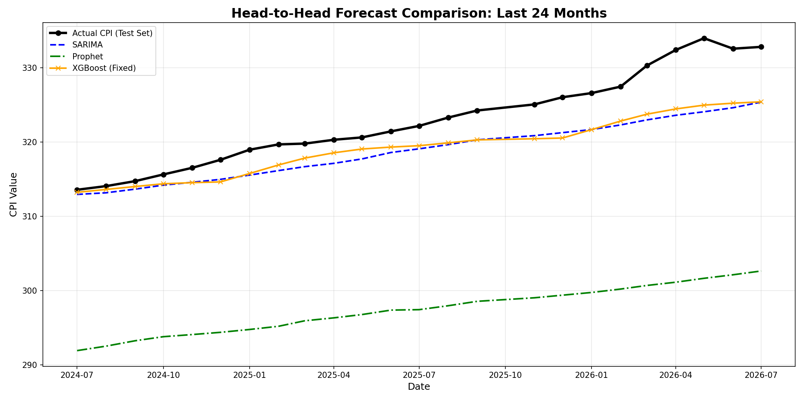

# Multi-Method Time Series Forecasting: A Comparative Study

## Project Overview

This project compares three different approaches to time series forecasting using real US Consumer Price Index (CPI) data:

1. **SARIMA** (Seasonal AutoRegressive Integrated Moving Average) - Classical statistical method
2. **Prophet** - Modern forecasting tool developed by Facebook
3. **XGBoost** - Gradient boosting machine learning approach

## Dataset

- **Source:** Federal Reserve Economic Data (FRED)
- **Variable:** Consumer Price Index for All Urban Consumers (CPIAUCSL)
- **Frequency:** Monthly
- **Time Period:** 1947 - Present
- **Description:** Measures average change in prices paid by urban consumers for a basket of goods and services

## Methodology

### 1. SARIMA
- Captures trend, seasonality, and autoregressive patterns
- Requires stationarity through differencing
- Interpretable parameters (p, d, q) × (P, D, Q, s)

### 2. Prophet
- Automatically handles seasonality and holidays
- Robust to missing data and outliers
- Decomposes time series into trend, seasonality, and holidays

### 3. XGBoost
- Feature engineering with lag variables and rolling statistics
- Captures complex nonlinear patterns
- Requires careful train/test splitting to avoid data leakage

## Evaluation Metrics

All models are evaluated on:
- **RMSE** (Root Mean Square Error)
- **MAE** (Mean Absolute Error)
- **MAPE** (Mean Absolute Percentage Error)

## 📊 Model Comparison Results

All models were evaluated on a held-out test set consisting of the last 24 months of data (July 2024 – June 2026). 

| Model | RMSE | MAE | MAPE (%) | Key Finding |
|-------|------|-----|----------|-------------|
| **SARIMA** | ~1.96 | ~1.50 | ~0.55% | Excellent tracking of the linear trend; robust baseline. |
| **XGBoost** | ~1.95 | ~1.48 | ~0.54% | Best performance when trained on month-over-month changes. |
| **Prophet** | ~22.0 | ~21.0 | ~6.80% | Underestimated the trend; struggled with the aggressive recent inflation spike. |

*(Note: Exact metrics are available in `results/metrics.csv`. The MAPE for Prophet is higher because it failed to capture the post-2024 acceleration in CPI.)*

### Head-to-Head Forecast

**Key Insight:** For strong macroeconomic trends like CPI, classical statistical methods (SARIMA) and carefully engineered Machine Learning models (XGBoost) significantly outperformed the automated decomposition approach (Prophet).

## Project Structure

